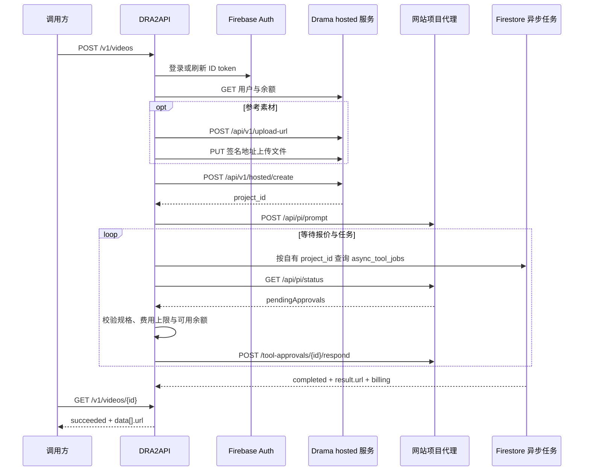

# Drama.Land 协议与规格证据

分析日期：2026-09-15。依据一次用户手动操作的网络记录、当前网页运行时配置、网站提供的模型 CLI 说明、当前账号的只读查询，以及一次网关实际生成。原始流量与用户内容未发布。

## 完整链路



### 1. 身份认证

Firebase `accounts:signInWithPassword` 接收邮箱、密码和 `returnSecureToken:true`，返回 ID token 与 refresh token。刷新使用 `securetoken.googleapis.com/v1/token`，表单字段为 `grant_type=refresh_token` 与 `refresh_token`。观察到 ID token 有效期 3600 秒。

浏览器会话位于 IndexedDB `firebaseLocalStorageDb/firebaseLocalStorage`，记录键以 `firebase:authUser:` 开头。网关读取 `stsTokenManager`，验证业务接口返回的 UID / 邮箱后保存。Firebase Web API key 是客户端项目标识，不等同于登录凭据。

### 2. 业务 API

业务源站 `https://agentic.dramastudio.ai` 使用 `Authorization: Bearer <ID token>`。

| 接口 | 用途 |
| --- | --- |
| `GET /api/v1/user/get_user_info` | UID、邮箱、套餐、功能 |
| `GET /api/v1/user/credits/summary` | 积分余额及批次 |
| `GET /api/v1/user/get_points_config` | 价格配置参考 |
| `GET /api/v1/subscription/current` | 订阅信息 |
| `GET /api/v1/task/list` | 签到等奖励任务，并非视频生成列表 |
| `POST /api/v1/task/daily-check` | 记录每日签到 |
| `POST /api/v1/task/claim` | 领取 `daily_login` 奖励 |
| `POST /api/v1/upload-url` | 申请素材签名上传地址 |
| `POST /api/v1/hosted/create` | 创建视频项目 |

签名上传请求包含 `filename`、`content_type`、`size_bytes`。按返回的 `upload_url` 使用相同 Content-Type PUT 文件，引用 `public_url`。签名有时效，不能当作长期素材地址。

创建项目的关键字段：

```json
{
  "name": "A lake at sunrise",
  "project_type": "video",
  "initial_intent": "A lake at sunrise",
  "initial_reference_list": [],
  "agent_profile": "fast",
  "fast_generation": {
    "kind": "video", "service": "seedance-2-0-mini",
    "aspect_ratio": "16:9", "resolution": "480p", "duration": 5
  },
  "user_language": "zh-cn"
}
```

每个参考必须携带真实 URL。观察到网站一次音乐引用没有 URL，未被工具消费；网关统一使用 `uploaded_file` 加 `url`、`media_type`、`mime_type`、`filename`，保留多音频输入。

### 3. 项目代理及费用审批

网站源站 `https://drama.land` 的 `/api/pi/*` 同时需要 Bearer token 与 `X-Project-Id`。

- `POST /api/pi/prompt`，`{"text":"","language":"zh-cn"}` 启动初始意图处理。
- `GET /api/pi/status` 返回流式状态与待审批报价。
- `POST /api/pi/tool-approvals/{approvalId}/respond`，`{"decision":"approved"}` 批准费用。
- `/api/pi/history`、`/api/pi/project` 可辅助手动排查；网关无需下载整段对话。

这是一条受网站代理调度的链路；代理可能重写提示词、要求补充输入或拒绝执行。`fast_generation` 不是直接供应商生成接口。

网关仅批准一个 `generate_video` 计费项，比较 service、resolution、duration_seconds、totalCredits 与 item credits。报价有 Aspect ratio 字段时同时核对。费用不超过 `max_credits` 且本账号可预留余额才提交批准；额外计费操作、模型切换均终止任务。音频开关没有可核对的报价字段。

业务价格配置还列出 chat 和 agentic_per_call_costs。`max_credits` 仅约束审批中的视频报价，不能拦截代理自行产生的其他扣费；费用样本中的 actual_cost 是视频任务账单，不是项目全量费用。本次 Mini 视频账单 225，测试前后记录的账号余额差为 229；额外 4 的具体账目未逐笔确认。

### 4. 异步结果

网页实际使用 Firestore 项目 `nooka-cloudrun-250627` 的 `async_tool_jobs` 集合。REST `documents:runQuery` 按 **已创建的自有 project_id** 过滤，不扫描其他项目。此集合的网页读取路径未附带 Firebase token；网关仍核对每条记录的 project_id 与当前账号 UID，不向外提供任意项目查询入口。

解码 Firestore typed values 后关注：`job_ref`、`status`、`service`、`user_id`、`project_id`、`result.url`、`agent_body.assets`、`billing.credits/status`。顶层 `status=completed` 是完成依据；供应商子状态可能滞后。已完成任务的查询不依赖网站代理在线。

网站还使用 SSE / Centrifugo 同步代理进度。网关选择持久化任务加轮询，不依赖浏览器保持打开，也不调用把结果重新注入代理对话的 dispatch 操作。

## 参数推导的边界

| 项目 | 证据与结论 |
| --- | --- |
| Mini | CLI：5–12 秒，480p / 720p；实际成功：5 秒 / 480p / 16:9；观察到单账号单 Mini 任务限制，默认并发 1 |
| Fast | 网页与 CLI：4–15 秒，480p / 720p；文生视频成功：4 秒 / 480p / 9:16；9 图 + 3 视频 + 3 音频成功：4 秒 / 480p / 16:9；不开放 1080p |
| 2.0 | 网页：4–15 秒，480p / 720p / 1080p；CLI 还描述 4k，作为未实测参数暴露 |
| 2.5 | 网页与官方页：5–30 秒、480p / 720p；已实测 5 秒 / 480p / 16:9，9 图 + 3 视频 + 3 音频；CLI 出现 1080p 与网页冲突，排除 |
| 比例 | 网页型号配置列出 16:9、9:16、1:1、4:3、3:4、21:9；没有 adaptive |
| 参考数量 | Fast 已实测 9 图 / 3 视频 / 3 音频，总计 15；Mini / Pro 仍采用各类 9 / 3 / 3、总计 10 的保守限制。2.5 30 / 10 / 10、总计 50，已实测 9 + 3 + 3；其上限尚未逐项实测 |
| 参考时长 | 2.0 系列视频总计 15.2 秒、音频总计 15 秒；2.5 的视频与音频合计最多 30 秒（CLI 明确约束）。ffprobe 检查真实文件时长，已实测视频 6 秒 + 音频 6 秒；边界尚未实测 |
| 价格 | 静态网页价格与业务价格配置不同；仅作为估算，审批报价与账单权威 |

生产询价进一步确认 Fast 4 秒 / 480p / 9:16 报价 260 credits，即 65 credits/秒；旧业务配置中的 45 credits/秒已不能直接用于该次请求。180 credits 的上限验证正确拒绝了这笔生成费用。

官方参考：[Seedance 2.5](https://drama.land/zh-cn/tools/seedance-2-5-video-generation)、[Seedance 2.0](https://drama.land/zh-cn/tools/seedance-2-video-generation)。不能仅凭一条 Mini 请求证明其他模型的账号权限、额度消耗、素材组合或输出画质。

## 风控与失败处理

| 信号 | 处理 |
| --- | --- |
| ID token 过期 / 401 | 使用 refresh token，持久化轮换凭据；明确 401 后最多重发一次 |
| Firebase CAPTCHA / MFA、浏览器 challenge | 标记需登录 / 人工验证，由用户在浏览器完成 |
| 403 / 账号停用 | 暂停当前请求，记录错误；不绕过验证 |
| 429 | 读取 Retry-After 并退避，不因限流重新创建项目 |
| 提交或审批发生网络超时 | 保存已发出的标记，查询原项目，不盲目重放可能计费的写入 |
| 代理停流且无报价 / 任务 | 等待短暂同步窗口后返回 AGENT_INPUT_REQUIRED，保留项目供人工检查 |
| 任务总超时 | 返回 expired；重试继续原项目查询，避免重复扣费 |
| 上游生成失败 | 保留原错误与计费状态；不承诺已退款，退款以账单为准 |
| 素材下载 / 解码失败、规格越界 | 拒绝生成并提供可定位的错误 |

账号身份、代理出口、浏览器登录状态应保持一致。网关默认每账号并发 1；提高并发前应验证账号与型号限制。

## 验证记录

2026-09-15 网关外部 API 文生视频验证：Mini、5 秒、480p、16:9、最高费用 225，提交到完成约 117 秒，返回可访问的视频 URL，账单 225 credits。API 测试请求不含用户原始提示词或素材。其余组合的校验已由离线测试覆盖，上游实际生成待验证。

另已实测签名上传一个 PNG 和两条 1 秒 WAV，文件类型、音频时长及三个完整参考 URL 均通过；该检查未创建生成项目，不代表多音频生成效果已经验证。

生产 HTTPS API Fast 验证：4 秒 / 480p / 9:16，提交到完成约 117 秒，视频账单 260 credits，结果下载与内容跳转成功。ffprobe 显示 496×864，视频轨 4.041667 秒，容器 4.096 秒；存在编码对齐。请求 generate_audio:false，但文件含非静音音轨（mean -17 dB、peak -4.9 dB），当前 hosted 指令链路不能保证关闭音频。

2.5 的 9 图 + 3 视频 + 3 音频已完成公网提交、全量素材核对、报价批准、异步生成、下载和管理端验证。实际生成费用 650 credits，5 秒 / 480p / 16:9 返回 854×480、约 5.04 秒的 H.264 视频及非静音 AAC 音轨。完整过程和效果边界见[15 份素材实测记录](verification-15-references.md)。

本次发现早期 Firestore 记录只有 `task_action=generate_video`、`task_subcommand=generate-video`、`task_service`，尚无 `type` / `task_id`。网关已兼容该状态，避免代理停流后误报 `AGENT_INPUT_REQUIRED`；原项目可恢复查询，不重新提交或审批。

Fast 同组 15 份素材已实际生成，4 秒 / 480p / 16:9，视频账单 260 credits。多视频与多音频应使用数组参数；重复传递单数 CLI 参数仅保留最后一项。上游曾提出错误示例报价和重复生成报价，均未执行；详细过程见 [Fast 实测记录](verification-fast-15-references.md)。当前网关对首个批准报价之后的额外报价发送 `decision=denied` 并继续查询原任务，避免重复收费和丢失已提交任务的结果。

已完成 79 项离线测试、管理端实际浏览器检查及 GitHub Actions 的构建 / 部署 / 代理运行环境 / 公网健康检查。Mini、Fast 与 2.5 的已验证组合见模型目录，其余组合保留未实测标记。
